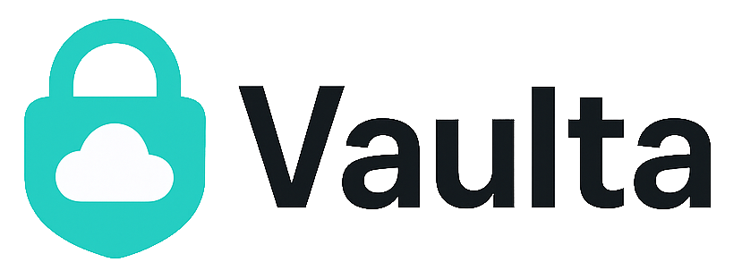

  
  
  

    A secure and flexible file storage service designed for modern applications. It supports both local and cloud-based storage (e.g., AWS S3), allowing you to manage uploads, downloads, and file visibility with ease.
  

## Key Features

- 📂 Upload files via FastAPI endpoints
- ☁️ Supports local storage and S3-compatible providers
- 🔒 Control file access: public or private
- 🔐 Generate signed download URLs for private files
- 🚀 Pluggable `StorageBackend` interface for extensibility
- 🧪 Production-ready and test-friendly design

## Use Cases

- Uploading and accessing user files securely
- Serving private media through signed links
- Reusable storage backend for microservices

## Coming Soon

- UI for file browsing and access control
- Support for Google Cloud Storage and MinIO
- File expiration and audit logging